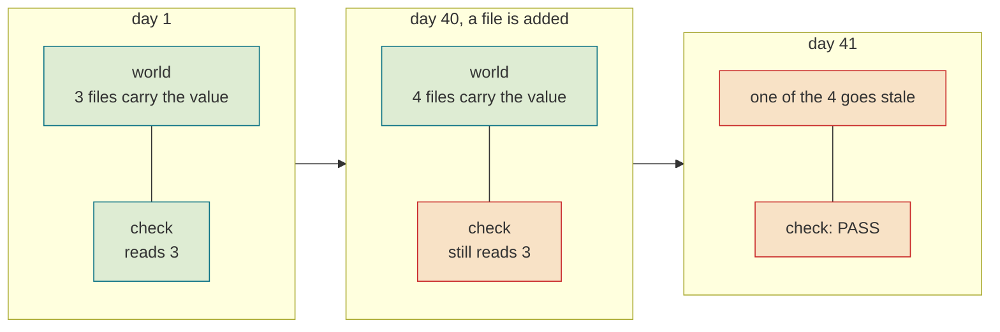
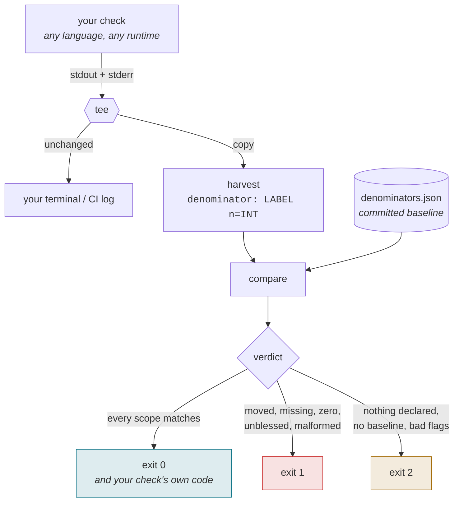
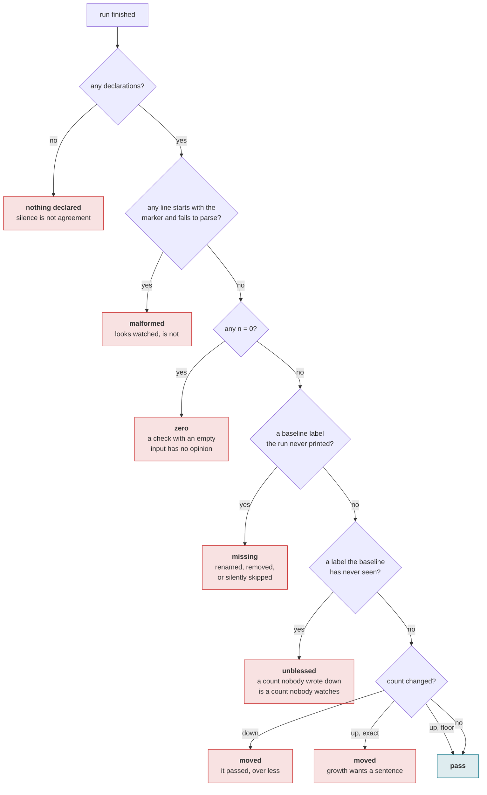
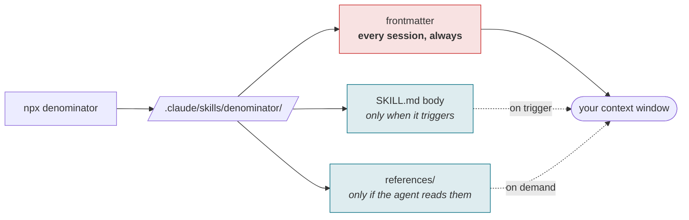
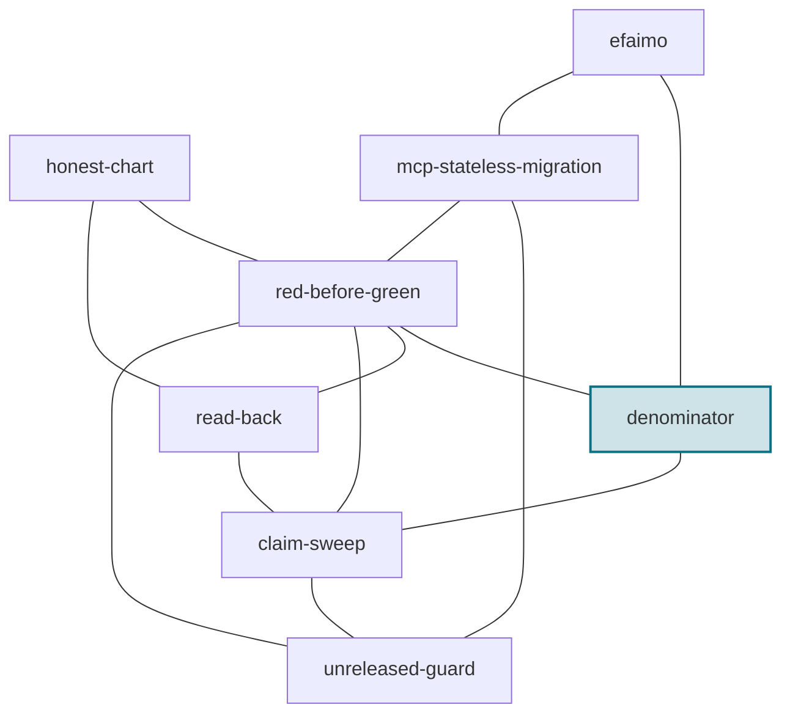

# denominator

**A passing check has a denominator. Print it, derive it, and fail when it moves.**

[](https://www.npmjs.com/package/denominator)
[](LICENSE)
[](package.json)
[](package.json)
[](https://github.com/efaimo-ai/denominator/actions/workflows/house-style.yml)

A check that passes reports a numerator: **zero problems**. The denominator, how
many things it examined to find zero, is almost never printed and almost never
what you assume.

Nobody breaks a denominator on purpose. It falls on its own, and green never
flickers.

This is an [Agent Skill](SKILL.md) and a 200-line CLI. No dependencies.

---

## The twelve seconds that explain it

A real check in a real repository. It guards a platform name that is globally
unique and cannot be changed after the account exists, so getting it wrong is
expensive. It reads every document that asserts that name and compares them.

On 2026-09-03 it was sabotage-tested and went red on demand. It was correct, it
was tested, and it was reading **two of the three** documents that carried the
value. The third had been wrong for a day.

Here is what each tool says about that exact state:

```console
$ node check-orientation.mjs
PASS  every place that instructs the makerName says "efaimo ai"  2 carriers agree

$ npx denominator -- node check-orientation.mjs
denominator FAIL  moved   "every place that instructs the makerName says "efaimo ai""
                          examined 2, down from 3. It still passed, over a smaller set.
```

The check is not wrong. It is *smaller*. That is the entire idea.

---

## The shape of the failure



The world grows. The check's reach does not. Nothing in the output moves, because
the output only ever described the numerator.

---

## Install

```sh
npx denominator --help          # no install
npm i -D denominator            # or as a dev dependency
```

<details>
<summary>0.1.0 has no provenance, and every version after it will</summary>

npm's trusted publishing is configured from an existing package's settings page,
so it cannot create a package that has never been published. The `v0.1.0` tag
fired the release workflow on 2026-09-04 and npm answered
`404 Not Found - PUT https://registry.npmjs.org/denominator`: not a permissions
failure, an ordering one.

So 0.1.0 was published from an authenticated session instead, which cannot mint
an OIDC attestation. From 0.1.1 the workflow takes it back and every release
carries SLSA provenance naming the commit that built it.

Saying so here is cheaper than having someone find a missing attestation and
wonder what else is missing. There is no GitHub Release for 0.1.0 either: cutting
one by hand stamps an operator's personal account onto a public page that cannot
be edited afterwards, so the workflow does it or nobody does.

</details>

## Quickstart

**1.** Make your check print one line per assertion that covers a *set*:

```
denominator: every path CLAUDE.md cites resolves n=23
```

**2.** Record what it declared today, with a reason:

```sh
npx denominator --bless --why "first baseline" -- node check.mjs
```

**3.** Run it in CI. Exit 1 the day a scope moves:

```sh
npx denominator -- node check.mjs
```

```console
$ npx denominator -- node check-orientation.mjs
...
orientation is current

denominator: 11 declared scope(s) match the baseline, 103 things examined in total
```

---

## How it works

It wraps your check. It does not parse your code, does not instrument your
runtime, and does not need to know what your check does.



Three exit codes, not two, on purpose. **"A scope moved"** and **"I could not
measure this run at all"** are different answers, and collapsing them is how a
broken harness reads as a clean tree.

Your check's own exit code survives: if every scope matches and the check failed
on its own terms, you get the check's code, not a zero.

---

## The verdicts



| verdict | what happened | why it is not a pass |
|---|---|---|
| `nothing declared` | no marker lines in the output | the run said nothing about what it examined |
| `zero` | a scope covered 0 things | a check with an empty input has no opinion to report |
| `malformed` | a line began with the marker and did not parse | it looks watched and is not; usually prose after the count |
| `duplicate` | one run gave two counts for one label | the run disagrees with itself about its own scope |
| `missing` | the baseline knows it, the run never printed it | the check was renamed, removed, or silently skipped |
| `unblessed` | the run declared a label nobody recorded | a denominator nobody wrote down is one nobody watches |
| `moved` | the count changed | down is a regression; up is the world changing, and worth a sentence |

---

## The wire format

One line. Nothing follows the count.

```
denominator: <label> n=<int>
```

That is the whole protocol, so anything that can print can adopt it:

```js
console.log(`denominator: cited paths resolve n=${paths.length}`);
```
```python
print(f"denominator: cited paths resolve n={len(paths)}")
```
```sh
echo "denominator: cited paths resolve n=${#paths[@]}"
```
```go
fmt.Printf("denominator: cited paths resolve n=%d\n", len(paths))
```

In JavaScript you can import the emitter instead of writing the line, which
refuses labels that would corrupt the parse:

```js
import { declare } from "denominator";
console.log(declare("cited paths resolve", paths.length));
```

A line that *begins* with `denominator:` and does not parse is reported, never
skipped. That case is the worst one this format can produce: the author believes
the scope is watched, and it is not.

Wrapping a tool you do not control, which already prints a count:

```sh
npx denominator --pattern '^OK\s+(?<label>.+?) checked: (?<n>\d+)$' -- ./legacy-check
```

That mode is strictly worse than emitting the marker, because you are parsing
prose nobody promised to keep stable. It exists for the case where changing the
tool is not yours to do.

---

## The baseline

```json
{
  "blessed": "2026-09-04",
  "why": "first baseline: the arrival ritual's set assertions",
  "counts": {
    "every project has a row in the CLAUDE.md table": 9,
    "every path CLAUDE.md cites resolves": 23,
    "no em/en dashes in maintained copy": 12,
    "the route list matches the routes on disk": 7,
    "skills discovered": "38+"
  }
}
```

- An **integer** is exact. The set is supposed to be stable, so movement in
  either direction wants a human sentence.
- A **`"N+"` string** is a floor. The set is supposed to grow, so growth passes.

Exact is the default, and that is the important choice. A floor cannot catch the
case this tool exists for: a scope that grew from 34 to 38 and then broke back to
34 satisfies a floor of 34 forever.

`--bless` requires `--why`. A baseline that changes without a sentence is a
baseline nobody can audit six months later, when the only question that matters
is whether anyone looked.

---

## Which assertions get a count

Two shapes. Only one of them can shrink.

| shape | example | denominator |
|---|---|---|
| **set** | "all 23 cited paths resolve" | 23, and it can fall to 19 without a word |
| **point** | "this folder is a repo and the doc says so" | none; one claim about one thing |

Leaving point assertions alone is correct, not lazy. A tool that demanded a
number from every assertion would teach you to invent them.

---

## What this is not

- **Not code coverage.** Coverage measures which *lines ran*. This measures which
  *things were examined*, which is a set your check defines and a coverage tool
  cannot see. A check can have 100% line coverage while reading two of three files.
- **Not a replacement for [`red-before-green`](https://github.com/efaimo-ai/red-before-green).**
  That one asks whether your check can fail at all. This one asks how much it can
  see. They are different properties and you need both: the check in the opening
  example had been sabotage-tested and still read two thirds of the world.
- **Not a linter for your check.** It never reads your source. It only reads what
  your check says about itself, which is the point: a claim and the instrument
  watching it have to cover the same span.
- **Not a metrics dashboard.** The count lives in the run that produced it, next
  to the assertion it belongs to. A number that travels separately from its claim
  eventually describes something nobody is asserting any more.

---

## Its own numbers

Audited by [efaimo](https://github.com/efaimo-ai/efaimo), the same tool this
project's siblings are graded by:

```
$ npx efaimo check --skill ./denominator
efaimo v0.4.0
check skill  denominator
grade A (100)   0 errors  0 warnings  0 info

  no findings. clean.

$ npx efaimo weigh ./denominator
  skill                        metadata      body  lines  refs
  denominator                        65       936     94  2 files 1,906

totals: metadata 65 (always loaded) | body 936 (on trigger) | referenced 1,906 (on demand)
```

Captured from `efaimo@0.5.0` on 2026-09-04.

**65 tokens sit in your context whether or not this skill ever fires.** That is
the number this skill's own family measures, so it is the number to be honest
about: it is the lightest of the seven skills efaimo ai publishes, and it is
still above the median of 39 across the public corpus efaimo indexes. The
description is long because a host selects skills by matching descriptions to
tasks, and that trade is a choice, not an accident.

Tests: 31, over the library and the spawned binary.

---

## The bug this shipped with

The first version spawned your check with `shell: true` on Windows, so that
`npm` and `npx`, which are `.cmd` shims there, would resolve. Node's own
deprecation notice says what that costs: with a shell and an argument array,
arguments are "not escaped, only concatenated". The first CLI test spawned
`process.execPath`, which on the author's machine is `C:\Program Files\nodejs\node.exe`,
and the shell received `C:\Program` as the command. Ten tests went red at once.

That is exactly the failure [`read-back`](https://github.com/efaimo-ai/read-back)
is about, arriving inside the tool whose job is to notice when a check stopped
covering what you think. It now spawns without a shell, and retries through one
only for a bare command name, with a command line it quoted itself.

---

<!-- generated:pipeline -->

## What installing it does to a session

A skill is not free just because it is markdown. Its frontmatter is loaded at
the start of every session for every skill you have installed, whether or not it
ever fires.



In this skill's case, measured by [efaimo](https://github.com/efaimo-ai/efaimo) `weigh` (v0.5.0, 2026-09-04):
**65 tokens always resident**, 936 when it triggers, 1,906 across 2 reference files if the agent reads to the end.

<!-- /generated:pipeline -->

<!-- generated:set -->

## The set

Every skill in this set is about a report that was true about the wrong thing.

| skill | something reported | what the report was really about |
|---|---|---|
| [`red-before-green`](https://github.com/efaimo-ai/red-before-green) | a check said clean | whether it ran at all |
| **`denominator`** | a check said clean | how much of the world it saw |
| [`read-back`](https://github.com/efaimo-ai/read-back) | a write said done | whether it applied |
| [`claim-sweep`](https://github.com/efaimo-ai/claim-sweep) | a change said done | everything else still asserting the old value |
| [`unreleased-guard`](https://github.com/efaimo-ai/unreleased-guard) | a document said true | which version it is true of |
| [`honest-chart`](https://github.com/efaimo-ai/honest-chart) | a picture said the data | whether its geometry is proportional |
| [`mcp-stateless-migration`](https://github.com/efaimo-ai/mcp-stateless-migration) | a server said ok | which revision it speaks |
| [`efaimo`](https://github.com/efaimo-ai/efaimo) | a tool said A(100) | what a grade certifies, and what it costs |



Each edge is a real handoff, not a category: the reason one skill points at
another is written into it at [efaimo.ai/skills](https://efaimo.ai/skills), and
in the `Siblings` section of every `SKILL.md`. All of them are graded and
weighed by [`efaimo`](https://github.com/efaimo-ai/efaimo), the CLI that measures
what an agent loads.

<!-- /generated:set -->

## License

Apache-2.0. See [LICENSE](LICENSE) and [NOTICE](NOTICE).
